# Pāvati Pustak

**Digital Trust, Donation & Receipt Management**

Pāvati Pustak is a full-stack web application for managing charitable trusts (**sanstha**) in the Indian trust ecosystem. It helps trust administrators and committee members track donations, auto-generate legally-compliant PDF donation receipts with QR codes, manage members and roles, run donation campaigns, and maintain a transparent audit trail — all with role-based access control.

## Table of Contents

- [Architecture](#architecture)
- [Repository Structure](#repository-structure)
- [Tech Stack](#tech-stack)
- [Workspace Packages](#workspace-packages)
- [Data Model](#data-model)
- [Getting Started](#getting-started)
- [Scripts](#scripts)
- [Environment Variables](#environment-variables)
- [Deployment](#deployment)
- [Testing](#testing)
- [Localization](#localization)

---

## Architecture

Pāvati Pustak is an **npm-workspaces monorepo** with four packages: a React single-page application, an Express REST API, a shared contracts package, and a standalone PDF receipt engine. The frontend and API communicate over a JSON API; the API persists to PostgreSQL via Prisma ORM and generates donation receipts through the receipt engine.



**Dependency direction:** Web and API both depend on the Shared package. The API depends on the Receipt Engine and Prisma. The Receipt Engine depends on Shared types. Everything converges on the Shared package as the source of truth for domain types, validation, and permissions.

---

## Repository Structure

```
pavatiApp/
├── package.json               # npm workspaces root manifest
├── tsconfig.base.json         # shared TypeScript compiler base config
├── Procfile                   # Heroku process definition (release + web)
├── apps/
│   ├── api/                   # @pavati/api — Express REST API
│   │   ├── prisma/
│   │   │   ├── schema.prisma  # domain model (18 models, 12 enums)
│   │   │   ├── migrations/    # SQL migration history
│   │   │   └── seed.ts        # admin user seed
│   │   └── src/
│   │       ├── index.ts       # server bootstrap & route mounting
│   │       ├── config/        # env-driven config
│   │       ├── lib/           # jwt, session, prisma, email, http, logger
│   │       ├── middleware/    # auth, rbac, validate, error, rateLimit
│   │       ├── providers/     # storage (S3/R2), messaging (email/WhatsApp)
│   │       ├── services/      # receipts, notifications, audit
│   │       ├── modules/       # 13 route modules (auth, trusts, donations, ...)
│   │       └── __tests__/     # integration & unit tests
│   └── web/                   # @pavati/web — React SPA
│       ├── index.html         # SPA shell
│       ├── vite.config.ts     # Vite build + API proxy
│       └── src/
│           ├── main.tsx       # React bootstrap & session hydration
│           ├── app/router.tsx # central router with role guards
│           ├── components/    # shared UI kit, layout, receipt preview, ...
│           ├── features/      # 17 feature modules (auth, donations, ...)
│           ├── lib/           # api client, stores (Zustand), i18n, utils
│           └── styles/        # Tailwind global styles
├── packages/
│   ├── shared/                # @pavati/shared — types, schemas, permissions
│   └── receipt-engine/        # @pavati/receipt-engine — PDF receipt generation
└── .ua/                       # Understand-Anything knowledge graph
```

---

## Tech Stack

### Backend (`@pavati/api`)
| Concern | Technology |
|---|---|
| Server framework | Express 4 |
| ORM / database | Prisma 6 + PostgreSQL |
| Auth | JWT (`jsonwebtoken`), bcrypt, session cookies, Google OAuth (`google-auth-library`) |
| Validation | Zod (shared schemas) |
| Receipts | pdf-lib + qrcode, @pavati/receipt-engine |
| Storage | AWS SDK S3 / Cloudflare R2 (presigned URLs) |
| Logging | Pino / pino-http |
| Rate limiting | express-rate-limit |
| Messaging | email + WhatsApp providers |

### Frontend (`@pavati/web`)
| Concern | Technology |
|---|---|
| UI framework | React 19 |
| Build tool | Vite 6 |
| Styling | Tailwind CSS 4 |
| Routing | react-router-dom 7 |
| Data fetching | TanStack Query |
| State | Zustand 5 |
| Forms / validation | React Hook Form + Zod |
| Charts | Recharts |
| Toasts | sonner |
| Fonts | @fontsource/mukta (Devanagari support) |

---

## Workspace Packages

| Package | Path | Role |
|---|---|---|
| `@pavati/api` | `apps/api` | Express REST API — 13 route modules, middleware, services, providers |
| `@pavati/web` | `apps/web` | React 19 SPA — 17 feature modules, shared UI, routing |
| `@pavati/shared` | `packages/shared` | Shared domain types, Zod schemas, RBAC permissions, constants, utils |
| `@pavati/receipt-engine` | `packages/receipt-engine` | Donation receipt PDF generation (pdf-lib + Canvas renderers) |

### API Route Modules (`apps/api/src/modules/`)
`auth` · `trusts` · `members` · `donations` · `templates` · `receipts` · `campaigns` · `announcements` · `notifications` · `reports` · `users` · `uploads` · `dashboard`

### Web Feature Modules (`apps/web/src/features/`)
`auth` · `onboarding` · `dashboard` · `donations` · `receipts` · `templates` · `members` · `announcements` · `campaigns` · `reports` · `notifications` · `settings` · `audit` · `donate` · `landing` · `account` · `trust`

---

## Data Model

The Prisma schema (`apps/api/prisma/schema.prisma`) defines **18 models** and **12 enums**. Core entities:

- **User** & **AuthProvider** — phone, email, or Google-authenticated users
- **Trust** — the managed entity; supports join modes (OPEN / APPROVAL / INVITE_ONLY), QR-code campaign URL
- **Member** — trust membership with a role and status (ACTIVE / INVITED / PENDING_APPROVAL / REMOVED)
- **Donation** — payments with status (PENDING / SUCCEEDED / FAILED / REFUNDED / CANCELLED), privacy levels, and per-campaign **donation splits**; records `submittedBy`
- **Receipt** — generated donation receipts with a trust-scoped unique receipt number and active/void status
- **Campaign** — fundraising campaigns (has the QR code URL), linked to donations
- **Template** — customizable receipt/template fields with A4/A5/A6/CUSTOM page sizes
- **Announcement**, **Notification**, **AuditLog**, **Report** — operational and compliance entities

**Roles** (`TrustRole`): `PRIMARY_ADMIN`, `ADMIN`, `PRESIDENT`, `VICE_PRESIDENT`, `SECRETARY`, `JOINT_SECRETARY`, `TREASURER`, `COMMITTEE_MEMBER`, `MEMBER`, `VOLUNTEER`, `COLLECTOR`.

**Payment modes**: `CASH`, `UPI`, `ONLINE`, `BANK_TRANSFER`, `CARD`, `OTHER`, `MIXED`.

Permissions are mapped per role in `packages/shared/src/permissions.ts` and enforced in `apps/api/src/middleware/rbac.ts`.

---

## Getting Started

### Prerequisites
- Node.js ≥ 20
- npm (with workspaces support, ≥ 9)
- PostgreSQL instance (or a `DATABASE_URL` pointing to one)

### Installation

```bash
# 1. Install dependencies across all workspaces
npm install

# 2. Configure the API environment (see .env section)
#    A Postgres DATABASE_URL is required.

# 3. Generate the Prisma client and apply migrations
npm run db:generate
npm run db:migrate

# 4. (Optional) Seed the database with an admin user
npm run db:seed
```

### Run in development

```bash
# Run both API (port 4000) and web (Vite) concurrently
npm run dev

# Or individually:
npm run dev:api   # tsx watch apps/api/src/index.ts
npm run dev:web   # vite
```

Open the web app (Vite dev server, default `http://localhost:5173`). The Vite config proxies `/api` requests to the API server.

### Build for production

```bash
npm run build        # builds all four packages in dependency order
npm run typecheck    # type-checks all four packages
```

---

## Scripts

| Command | Description |
|---|---|
| `npm run dev` | Run API + web concurrently |
| `npm run dev:api` | Run the API dev server (tsx watch) |
| `npm run dev:web` | Run the Vite dev server |
| `npm run build` | Build shared → receipt-engine → api → web |
| `npm run typecheck` | Type-check all workspaces |
| `npm test` | Run receipt-engine + API tests (Vitest) |
| `npm run db:migrate` | Run Prisma migration (name: init) |
| `npm run db:seed` | Seed the database |
| `npm run db:studio` | Open Prisma Studio |

---

## Environment Variables

Environment-specific files live in `apps/api/` (e.g. `.env`, `.env.r2`, `.env.resend`, `.env.google`). These are gitignored. Key variables:

| Variable | Purpose |
|---|---|
| `DATABASE_URL` | PostgreSQL connection string (Prisma datasource) |
| `JWT_SECRET` | Secret for signing JWT tokens |
| `R2_*` / `AWS_*` | Object storage credentials (Cloudflare R2 / AWS S3) |
| `RESEND_API_KEY` / messaging keys | Email and notification provider credentials |
| `GOOGLE_*` | Google OAuth client credentials |

> Copy `.env.example`-style values into your local `.env` as needed. The API reads config from `apps/api/src/config/`.

---

## Deployment

The project is configured for **Heroku** deployment via the root `Procfile`:

```
release: npx prisma migrate deploy --schema apps/api/prisma/schema.prisma
web: node apps/api/dist/src/index.js
```

- The **release** process runs Prisma migrations against the production database before deploy.
- The **web** process serves the compiled API (`apps/api/dist`).
- `heroku-postbuild` runs `prisma generate` + `npm run build` on deploy.

A documented deployment plan (storing receipts on Cloudflare R2, Heroku setup) is available at `.opencode/plans/heroku-r2-deployment.md`.

---

## Testing

Tests use **Vitest**.

```bash
npm test
```

Coverage includes:
- **API integration** (`apps/api/src/__tests__/`): app smoke test (`app.test.ts`), Google OAuth (`google.test.ts`), WhatsApp notifications (`whatsapp.test.ts`), RBAC permissions (`permissions.test.ts`), Zod schemas (`schemas.test.ts`)
- **Receipt engine layout** (`packages/receipt-engine/src/layout.test.ts`): unit tests for the layout engine

---

## Localization

The web app ships a lightweight custom i18n system (`apps/web/src/lib/i18n.ts`) with support for **English, Marathi, and Hindi** — a natural fit for Indian trust administration. Locale is persisted in `localStorage` and falls back to English.

---

## Knowledge Graph

Architecture details, layers, nodes, edges, and a guided tour are available as an interactive knowledge graph generated by **Understand-Anything**, stored in `.ua/knowledge-graph.json`. Launch the dashboard to explore:

```bash
# (via the understand-dashboard skill)
```

---

## License

Private project. © Pāvati Pustak.
